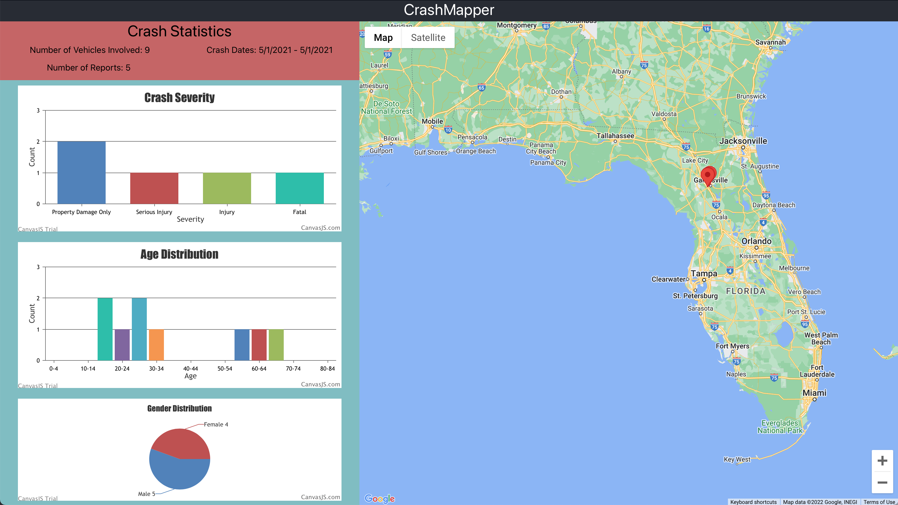
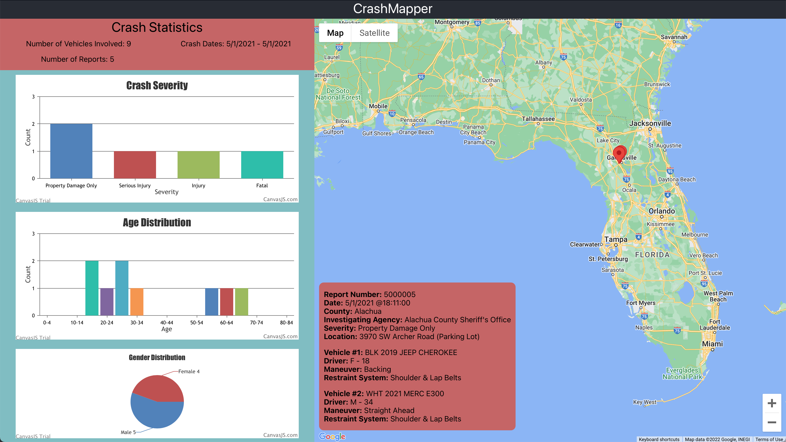
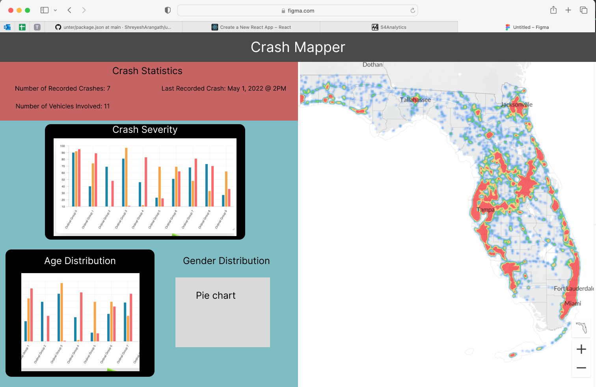

# Crash Mapper
Crash Mapper is a technical interview assignment with the aim of creating a relational DB and a dashboard that contains both a mapping api and a summarization of data.

## How To Run
### Server:
- Change your directory to the server directory 'cd server/'

- Install required npm packages 'npm i'

- Start Node Server 'npm start'

### GUI/Dashboard:
- Ensure that you are in the CRASH_MAPPER root directory CRASH_MAPPER

- Install required npm packages 'npm i'

- Start React Server 'npm start'

## Server Dependencies 
View all server dependencies under server/package.json

## Dashboard Dependencies
View all dashboard dependencies under package.json

## Tech Stack
ReactJS - Express - Node - MySQL

## Color Palate 

https://coolors.co/dff2d8-c6dea6-7ebdc3-7a6263-ced097

#DFF2D8
#C6DEA6
#7EBDC3
#7A6263
#CED097

## Example Dashboard

## Figma Prototype

https://www.figma.com/file/f3gaYYAnLbRBK97EP8pqCL/CrashMapperPrototype?node-id=0%3A1&t=I4hUytBA3nNWUItO-1
